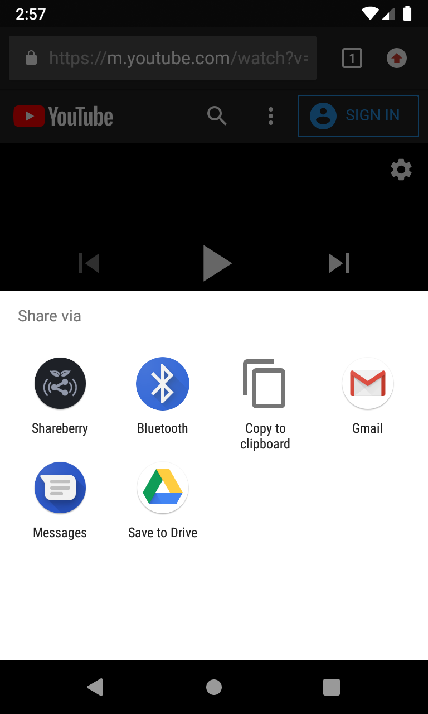
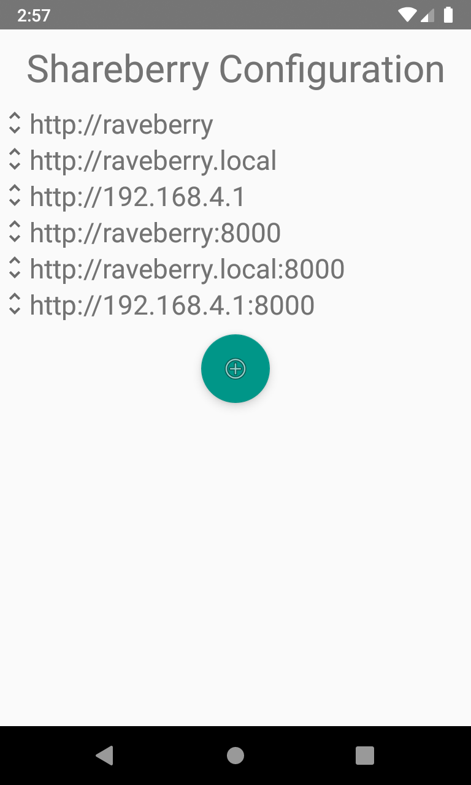

# Shareberry

Shareberry is an Android app that makes it possible to share songs to [Raveberry](https://github.com/raveberry/raveberry).

  
   

On the left you can see the Shareberry icon in the 'Share via' menu of android. When chosen, it will send a request containing the shared link to Raveberry, where it will be queued.

On the right you can see the configuration page of Shareberry with the default settings. When sharing a link, it will try the given urls in order until Raveberry could be reached or all urls have been tried.

A prebuilt apk can be found at app/release/shareberry.apk
[`app/release/shareberry.apk`](app/release/shareberry.apk)
